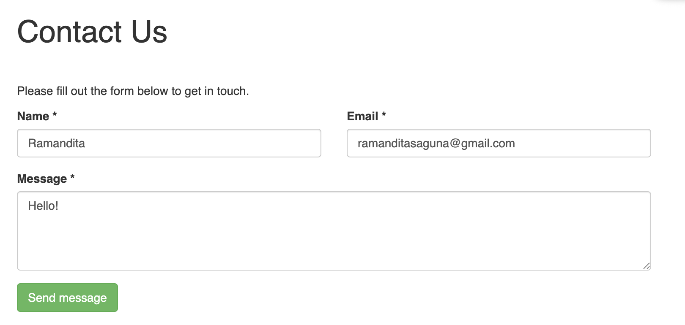
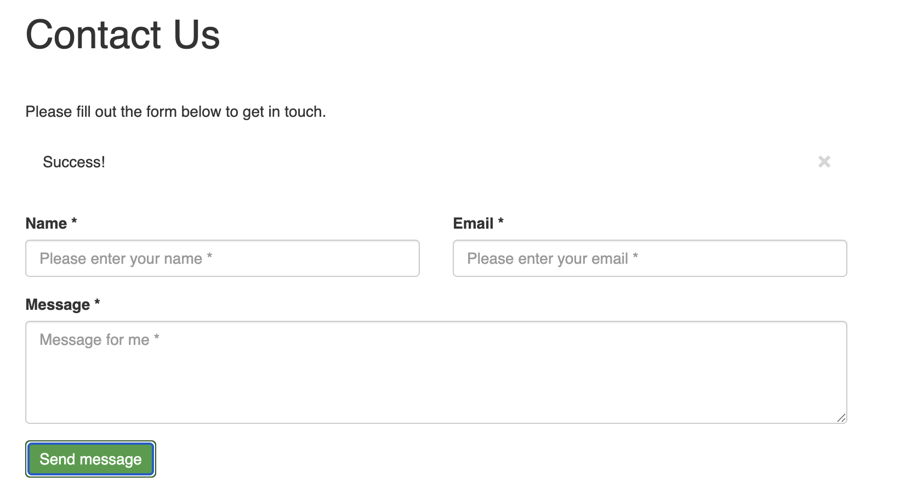

# AJAX Contact Form with jQuery, PHP, and Bootstrap

A modern, responsive, and easy-to-integrate contact form that uses AJAX to submit data without page refresh. Built with PHP for server-side processing, jQuery for seamless client-side validation and interaction, and Bootstrap for a clean, professional look.


*A preview of the contact form in action.*

## ✨ Features

-   **Seamless User Experience:** AJAX-powered form submission means no page reloads, providing a fast and smooth experience for users.
-   **Instant Feedback:** Real-time success and error messages are displayed to the user without interrupting their workflow.
-   **Client-Side Validation:** Built-in validation with jQuery to ensure required fields are filled correctly before the form is submitted.
-   **Server-Side Validation & Security:** PHP script validates and sanitizes input on the server to prevent malicious data and ensure data integrity.
-   **Responsive Design:** Fully responsive layout using Bootstrap 3, ensuring the form looks great on all devices, from desktops to mobile phones.
-   **Easy Configuration:** Simple to set up and configure. Just change the recipient email address in the PHP file.
-   **Email Notifications:** Automatically sends an email with the form submission details to the configured admin address.

## 📂 Project Structure

The project is organized with a clear and understandable structure:

```
/pwebnew
|-- /assets
|   |-- /css
|   |   `-- style.css       # Custom styles
|   `-- /js
|       `-- script.js       # jQuery and AJAX logic
|-- index.html              # The main HTML form
`-- process.php             # Server-side PHP script
```

## 🚀 Getting Started

Follow these steps to get the contact form up and running on your website.

### Prerequisites

-   A web server with PHP support (PHP 5.6+ recommended).
-   Basic knowledge of HTML and PHP.


## 🖼️ Screenshots

### Form View




### Success Message



